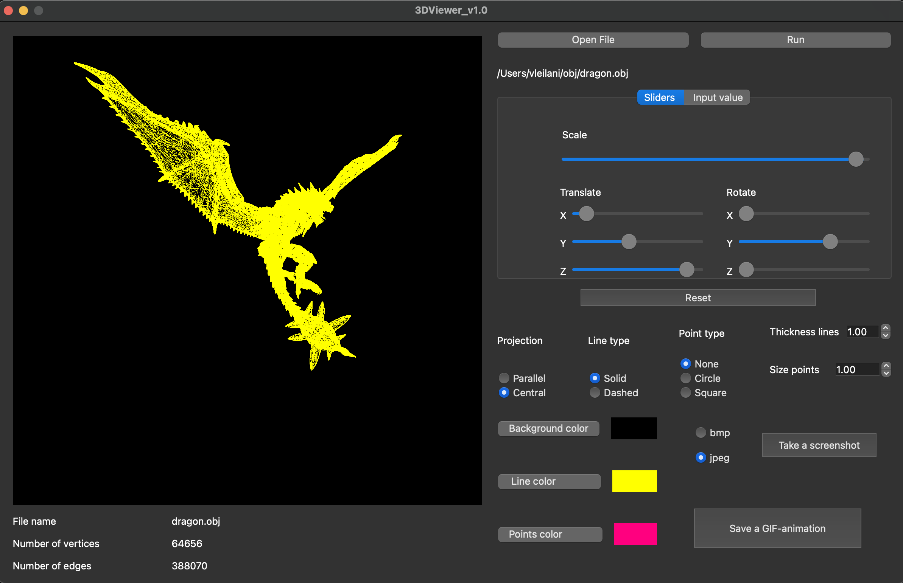
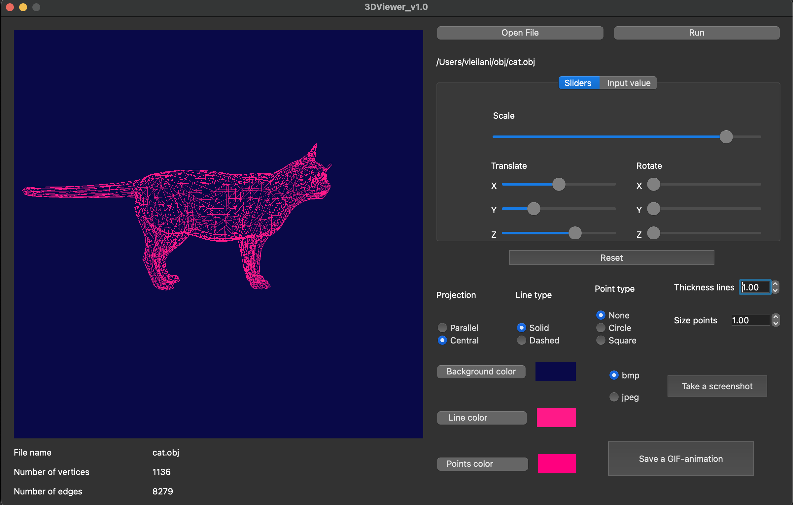
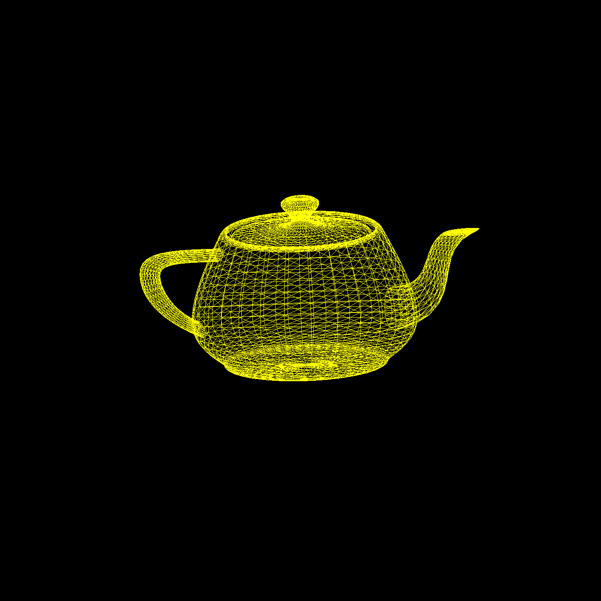

# 3D_Viewer_1.0

  

## During this project, we developed a program that allows you to view .obj files in 3D. The program automatically parses objects, and allows you to rotate, zoom in and out of objects from the camera.

# Using

To work, you need to download the file by clicking the appropriate button.

To control the camera you can use:
- Rotate the object with the mouse;

| Keys | Action |
| ----- | ----- |
| W     | Moves the camera forward |
| A     | Moves the camera backwards |
| S     | Moves the camera to the left |
| D     | Moves the camera to the right |
| Control     | Moves the camera up |
| Space     | Moves the camera down |

Using sliders or changing values ​​in input fields

- Move the model a specified distance relative to the X, Y, Z axes.
- Rotate the model by a given angle relative to its X, Y, Z axes.
- Scale the model by a given value.

# Settings

  

The program allows you to configure and save the following parameters:

- Type of projection (parallel and central)
- Edge type (solid, dashed)
- Color and thickness of edges
- Display method (none, circle, square)
- Color and size of verticals
- Select background color

You can also work with the object through the corresponding settings, setting the location of the object.

# The program has the following functions

  

- Save captured (rendered) images in bmp and jpeg format
- Record small screencasts as GIF animations

# Makefile

- `all`: Installation and launch
- `install`: Compiles and installs the application
- `open`: Runs the application
- `uninstall`: Deletes the application
- `clean`: Deletes all temporary files (test files, documentation)
- `dvi`: Generates documentation in html format
- `dist`: Archives a directory with binary files
- `test`: Runs tests
- `gcov_report`: Generates html file coverage
